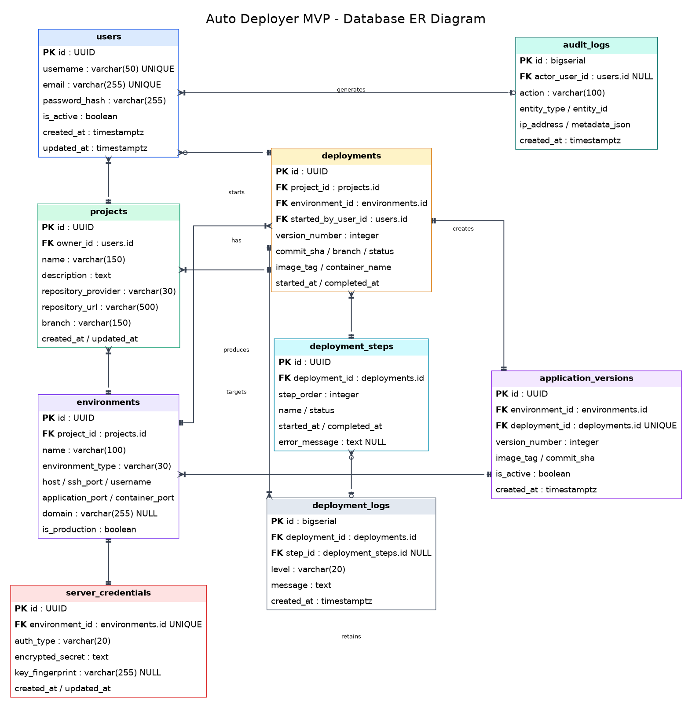
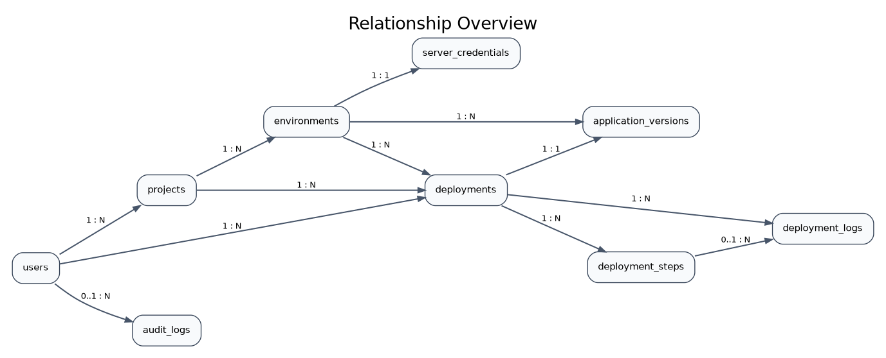

# 04 - Database Design

## 4.1 Purpose

This section defines the persistence model for the Auto Deployer Platform MVP. The design supports secure tenant isolation, deployment traceability, rollback, reporting and future extension to Windows IIS and AWS EKS.

## 4.2 Why PostgreSQL?

PostgreSQL is selected because it provides:

- Reliable ACID transactions for deployment and version state changes.
- Strong relational integrity through primary keys, foreign keys, unique constraints and check constraints.
- Native UUID, JSONB and timestamp-with-time-zone support.
- Advanced indexing options such as B-tree, partial indexes, GIN and BRIN.
- Row-Level Security support for an additional tenant-isolation layer.
- Mature SQLAlchemy and Alembic integration.
- Open-source licensing and broad operational support.
- A clear growth path from a local Docker container to managed cloud PostgreSQL services.

## 4.3 Design Principles

1. Every tenant-owned record must be reachable through a user-owned project.
2. Sensitive credentials must be encrypted, never hashed when later decryption is required, and never returned by normal API responses.
3. Deployment history must be append-oriented and auditable.
4. Rollback must use previously persisted immutable version metadata.
5. Time values use UTC `TIMESTAMPTZ`.
6. Public identifiers use UUIDs to reduce predictable-ID exposure.
7. Database constraints complement, but do not replace, API authorization checks.

## 4.4 ER Diagram

## 4.5 Relationship Summary

## 4.6 Table Catalogue

### `users`

- **Purpose:** Stores platform identities and account status.
- **Implementation status:** Implemented
- **Primary key:** id (UUID)
- **Foreign keys:** -
- **Index strategy:** UNIQUE(username), UNIQUE(email), INDEX(is_active)
- **Retention:** Retained while the account exists; anonymized or deleted according to account deletion policy.

### `projects`

- **Purpose:** Stores repositories and branch configuration owned by a user.
- **Implementation status:** Implemented
- **Primary key:** id (UUID)
- **Foreign keys:** owner_id -> users.id
- **Index strategy:** INDEX(owner_id), optional UNIQUE(owner_id, name)
- **Retention:** Deleted with the owning user or explicitly by the owner; child environments/deployments cascade by policy.

### `environments`

- **Purpose:** Defines deployment targets such as Linux Docker, Windows IIS or AWS EKS.
- **Implementation status:** Planned for MVP
- **Primary key:** id (UUID)
- **Foreign keys:** project_id -> projects.id
- **Index strategy:** INDEX(project_id), INDEX(project_id, environment_type), optional UNIQUE(project_id, name)
- **Retention:** Retained until removed by the project owner; deployment history may be retained independently.

### `server_credentials`

- **Purpose:** Stores encrypted SSH/password/private-key material associated with an environment.
- **Implementation status:** Planned for MVP
- **Primary key:** id (UUID)
- **Foreign keys:** environment_id -> environments.id
- **Index strategy:** UNIQUE(environment_id)
- **Retention:** Deleted immediately when the environment is removed; secrets are never written to logs.

### `deployments`

- **Purpose:** Represents each deployment or rollback execution and its final state.
- **Implementation status:** Planned for MVP
- **Primary key:** id (UUID)
- **Foreign keys:** project_id -> projects.id; environment_id -> environments.id; started_by_user_id -> users.id
- **Index strategy:** INDEX(environment_id, started_at DESC), INDEX(project_id, started_at DESC), INDEX(status), UNIQUE(environment_id, version_number)
- **Retention:** Metadata retained for 12 months by default; configurable for production environments.

### `deployment_steps`

- **Purpose:** Tracks ordered execution stages such as clone, analyse, build, connect, deploy and verify.
- **Implementation status:** Planned for MVP
- **Primary key:** id (UUID)
- **Foreign keys:** deployment_id -> deployments.id
- **Index strategy:** UNIQUE(deployment_id, step_order), INDEX(deployment_id, status)
- **Retention:** Same retention period as the parent deployment.

### `deployment_logs`

- **Purpose:** Stores timestamped, masked deployment output for reporting and troubleshooting.
- **Implementation status:** Planned for MVP
- **Primary key:** id (BIGSERIAL)
- **Foreign keys:** deployment_id -> deployments.id; step_id -> deployment_steps.id (nullable)
- **Index strategy:** INDEX(deployment_id, created_at), INDEX(level), optional BRIN(created_at) for high volume
- **Retention:** Detailed logs retained for 90 days by default; summaries remain with deployment metadata.

### `application_versions`

- **Purpose:** Stores deployable artifacts/images used for version history and rollback.
- **Implementation status:** Planned for MVP
- **Primary key:** id (UUID)
- **Foreign keys:** environment_id -> environments.id; deployment_id -> deployments.id
- **Index strategy:** UNIQUE(deployment_id), UNIQUE(environment_id, version_number), INDEX(environment_id, is_active)
- **Retention:** The latest 10 successful versions per environment are retained; older artifacts are pruned safely.

### `audit_logs`

- **Purpose:** Captures security-sensitive user actions and configuration changes.
- **Implementation status:** Planned for MVP
- **Primary key:** id (BIGSERIAL)
- **Foreign keys:** actor_user_id -> users.id (nullable)
- **Index strategy:** INDEX(actor_user_id, created_at), INDEX(entity_type, entity_id), BRIN(created_at)
- **Retention:** Retained for at least 12 months; append-only and excluded from normal user deletion flows where legally permitted.

## 4.7 Primary and Foreign Key Strategy

- UUID primary keys are used for user-facing domain entities.
- BIGSERIAL keys are acceptable for high-volume append-only logs.
- `projects.owner_id` is mandatory and is the root of owner isolation.
- Foreign keys use `ON DELETE CASCADE` only where child records have no independent compliance value.
- Deployment and audit records should generally use restrictive or soft-delete-aware policies to prevent accidental loss of history.
- Composite unique constraints prevent duplicate version numbers and duplicate step order values.

## 4.8 Index Strategy

### Mandatory indexes

- Unique B-tree indexes on `users.username` and `users.email`.
- B-tree indexes on all foreign-key columns used in authorization and joins.
- Composite indexes matching common dashboard queries:
  - `(owner_id, created_at DESC)`
  - `(project_id, created_at DESC)`
  - `(environment_id, started_at DESC)`
  - `(deployment_id, step_order)`
- Unique `(environment_id, version_number)` for deterministic rollback identifiers.
- Partial index on active versions can be introduced:
  - `WHERE is_active = true`
- BRIN indexes are suitable for very large chronological log/audit tables.

### Indexing rules

- Avoid indexing encrypted secret material.
- Add indexes from measured query patterns, not every column.
- Review unused and duplicate indexes before production release.
- Use `EXPLAIN (ANALYZE, BUFFERS)` when optimizing slow queries.

## 4.9 Data Retention and Deletion Policy

| Data category | Default retention | Deletion behavior |
|---|---:|---|
| User accounts | Account lifetime | Delete/anonymize on verified request |
| Projects and environments | Until owner deletion | Cascade active configuration records |
| Server credentials | Environment lifetime | Immediate secure deletion |
| Deployment metadata | 12 months | Scheduled archival or deletion |
| Detailed deployment logs | 90 days | Automated pruning; keep summaries |
| Application versions | Latest 10 successful versions | Remove old artifacts after reference checks |
| Audit logs | Minimum 12 months | Append-only retention; restricted deletion |

The retention values are MVP defaults and must be configurable for production deployments.

## 4.10 Security and Tenant Isolation

- Every project query must include the authenticated owner's identifier.
- Environment and deployment access must be authorized through the owning project.
- PostgreSQL Row-Level Security is recommended as a defense-in-depth control after the MVP API layer is stable.
- Server credentials must use authenticated encryption such as AES-256-GCM or a managed secret store.
- Passwords use one-way Argon2 hashing and are never decryptable.
- Logs must mask passwords, tokens, connection strings, private keys and authorization headers.
- Database users must follow least privilege; migration and application roles should be separate in production.

## 4.11 Integrity Constraints

Recommended checks include:

- `ssh_port BETWEEN 1 AND 65535`
- `application_port BETWEEN 1 AND 65535`
- `container_port BETWEEN 1 AND 65535`
- `version_number > 0`
- Deployment status limited to a controlled enum/set.
- Repository provider limited to supported values.
- Exactly one active version per environment, enforced by a partial unique index in PostgreSQL.

## 4.12 Migration Strategy

- All schema changes are versioned through Alembic.
- Migration files are reviewed before execution.
- Destructive migrations require backup and rollback planning.
- Production releases use forward-only application migrations whenever possible.
- Data backfills are separated from long-running schema locks when data volume grows.

## 4.13 Backup and Recovery

For production use:

- Automated daily backups.
- Point-in-time recovery where supported.
- Regular restore tests.
- Encrypted backup storage.
- Recovery objectives documented as RPO and RTO.
- Database backup does not replace container image/artifact retention.

## 4.14 MVP Acceptance Criteria

- `users` and `projects` tables remain compatible with the implemented API.
- A project cannot exist without an owner.
- A user cannot retrieve another user's project through API identifier manipulation.
- Environments are always linked to a project.
- Each deployment is linked to its project, target environment and initiating user.
- The latest ten successful application versions can be identified deterministically.
- Credential data is encrypted and excluded from API responses and logs.
- Deployment logs can be queried efficiently by deployment and timestamp.
