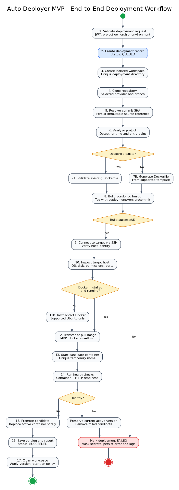
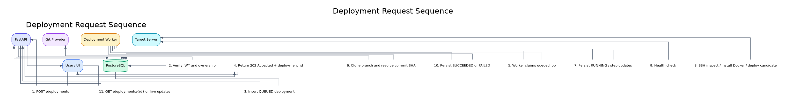
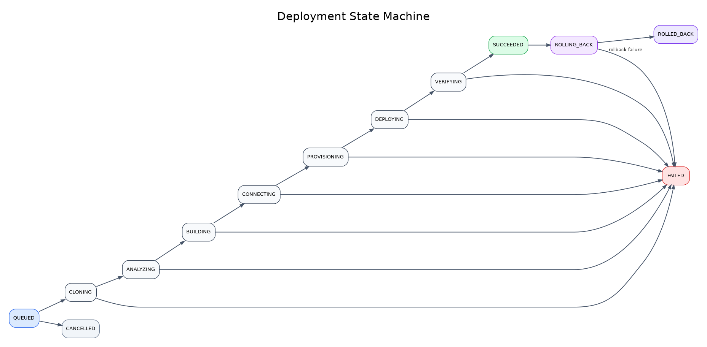
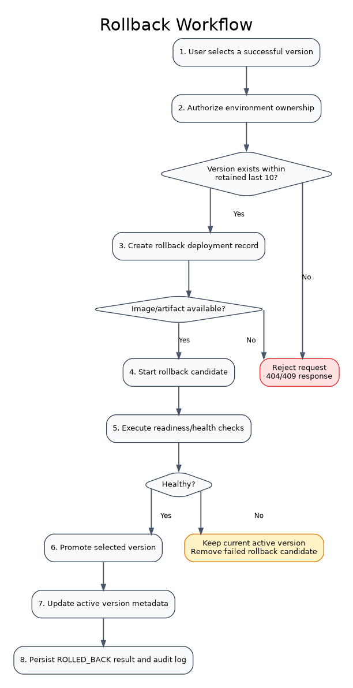

# 06 - Deployment Workflow

## 6.1 Purpose

This section defines the complete deployment lifecycle for the Auto Deployer MVP, from the authenticated API request to a verified running container and persisted version record. It also defines failure handling, rollback, state transitions, idempotency, logging and security controls.

## 6.2 MVP Workflow Scope

The MVP deployment workflow supports:

- A project registered with a GitHub or Azure DevOps repository and branch.
- A user-owned Ubuntu Linux environment reachable through SSH.
- Existing Dockerfiles and generated Dockerfiles for explicitly supported project types.
- Image building on the Auto Deployer worker.
- Image transfer through `docker save` / secure copy / `docker load`.
- Candidate-container deployment followed by health verification.
- Retention of the latest ten successful versions per environment.
- Rollback to a retained successful version.

The first implementation does not include Windows IIS, AWS EKS, blue-green traffic splitting, canary deployment or automatic database rollback.

## 6.3 End-to-End Workflow

### Workflow stages

1. **Request validation**  
   Validate JWT, project ownership, environment ownership, repository configuration and required deployment inputs.

2. **Deployment record creation**  
   Insert a deployment with `QUEUED` status and return its identifier immediately.

3. **Workspace creation**  
   Create an isolated directory such as `workspace/{deployment_id}`. The worker must never reuse a dirty workspace.

4. **Repository clone**  
   Clone the selected provider and branch using a least-privilege token where required.

5. **Commit resolution**  
   Resolve and persist the exact commit SHA so the deployment source is immutable and auditable.

6. **Project analysis**  
   Detect the project runtime, manifest, build command, expected port and application entry point.

7. **Dockerfile selection**  
   Use and validate an existing Dockerfile, or generate one only for a supported project template.

8. **Image build**  
   Build an immutable versioned image. Recommended tag format:
   `project-slug:env-version-shortsha`

9. **Target connection and inspection**  
   Connect over SSH, verify the host identity, detect the operating system, check disk space, privileges and port conflicts.

10. **Docker provisioning**  
    If Docker is missing, install it only on supported Ubuntu versions and verify the service is running.

11. **Image delivery**  
    MVP default: `docker save`, secure transfer and `docker load`. A registry-based flow can replace this later.

12. **Candidate deployment**  
    Start a uniquely named candidate container without destroying the current active version.

13. **Health verification**  
    Check container state and the configured HTTP readiness endpoint within a bounded timeout.

14. **Promotion**  
    After successful verification, replace the previous active container and mark the new version active.

15. **Persistence and cleanup**  
    Save steps, logs and version metadata, then remove temporary files and prune versions older than the last ten successful releases.

## 6.4 Request Sequence

The API does not perform the deployment inside the HTTP request. It validates the request, writes a queued job and responds with `202 Accepted`. A background worker owns long-running clone, build, SSH and health-check operations.

## 6.5 Deployment State Machine

### Terminal states

- `SUCCEEDED`
- `FAILED`
- `CANCELLED`
- `ROLLED_BACK`

A deployment must not return from a terminal state to a running state. Retrying a failed deployment creates a new deployment record referencing the previous attempt.

## 6.6 Step Catalogue

| Order | Step | Required output |
|---:|---|---|
| 1 | ValidateRequest | Authorized project and environment |
| 2 | CreateWorkspace | Empty isolated directory |
| 3 | CloneRepository | Local source tree |
| 4 | ResolveCommit | Commit SHA |
| 5 | AnalyzeProject | Runtime and build metadata |
| 6 | PrepareDockerfile | Valid Dockerfile |
| 7 | BuildImage | Immutable image tag |
| 8 | ConnectServer | Verified SSH session |
| 9 | InspectServer | OS, resources and port report |
| 10 | EnsureDocker | Running Docker service |
| 11 | TransferImage | Image available on target |
| 12 | StartCandidate | Running candidate container |
| 13 | VerifyHealth | Successful readiness result |
| 14 | PromoteVersion | New active container |
| 15 | PersistVersion | Application version record |
| 16 | Cleanup | Workspace and retention cleanup |

## 6.7 Failure Handling

### General rules

- Each step records start time, completion time, status and a sanitized error message.
- Secret values must be masked before logs are persisted.
- Failures before promotion leave the currently active container untouched.
- A failed candidate container is stopped and removed.
- Build, SSH and health-check operations use explicit timeouts.
- An unexpected worker interruption leaves the deployment in a recoverable stale-running state that can be reconciled.

### Failure categories

| Category | Examples | Result |
|---|---|---|
| Validation | Unauthorized project, missing environment | Request rejected before queueing |
| Repository | Invalid token, missing branch | Deployment `FAILED` |
| Analysis | Unsupported runtime, no entry point | Deployment `FAILED` |
| Build | Dependency failure, invalid Dockerfile | Deployment `FAILED` |
| Connection | Timeout, host-key mismatch | Deployment `FAILED` |
| Provisioning | No sudo access, unsupported OS | Deployment `FAILED` |
| Runtime | Port collision, container exits | Deployment `FAILED` |
| Health | Readiness timeout, HTTP error | Candidate removed; active version preserved |

## 6.8 Health-Check Policy

The MVP supports:

- Docker container state inspection.
- HTTP or HTTPS readiness URL.
- Configurable expected status code, default `200`.
- Configurable timeout and retry interval.
- Optional initial delay for application startup.
- Sanitized response excerpts for failure reporting.

A deployment is not successful merely because the container process started.

## 6.9 Versioning Strategy

Each successful deployment creates one immutable application-version record containing:

- Environment identifier.
- Deployment identifier.
- Monotonic environment version number.
- Commit SHA.
- Image tag.
- Creation timestamp.
- Active/inactive state.

Only one version can be active per environment. The latest ten successful versions are retained for rollback.

## 6.10 Rollback Workflow

Rollback creates a new auditable deployment action. It does not rewrite or delete the original deployment record.

## 6.11 Idempotency and Concurrency

- `POST /deployments` should accept an optional idempotency key.
- Only one mutating deployment operation may run per environment at a time.
- A PostgreSQL advisory lock or environment-level worker lock can enforce this rule.
- Duplicate worker delivery must not create duplicate version numbers or multiple active containers.
- Version allocation occurs transactionally.

## 6.12 Workspace and Artifact Rules

- Workspace path uses the deployment UUID and is never derived directly from user input.
- Repository URLs, branch names and filenames are validated against command-injection and path-traversal risks.
- Build execution occurs in an isolated environment with bounded CPU, memory, disk and duration where possible.
- Temporary repository tokens are not written into cloned remotes or logs.
- Workspace cleanup runs after success, failure and cancellation.

## 6.13 Logging and Reporting

The deployment detail screen should show:

- Deployment identifier and version.
- Project, environment, branch and commit SHA.
- Initiating user.
- Start/end times and duration.
- Current and terminal status.
- Ordered step results.
- Sanitized log stream.
- Image tag and container name.
- Health-check result.
- Previous and resulting active versions.

## 6.14 Security Controls

- JWT authentication and owner-based authorization are performed before queueing.
- Repository and server secrets are decrypted only inside the worker when needed.
- SSH host-key verification is mandatory; blind `AutoAddPolicy` is not acceptable in production.
- Shell commands use fixed templates and validated values.
- Docker installation scripts are versioned and restricted to supported operating systems.
- The worker must not expose the Docker socket to untrusted application code without isolation.
- Secret patterns are redacted from logs and exception messages.

## 6.15 Cancellation

MVP cancellation behavior:

- `QUEUED` deployments can be cancelled immediately.
- Running deployments receive a cancellation request and stop at a safe step boundary.
- Cancellation before promotion preserves the active version.
- Cancellation after promotion is rejected or handled as a rollback action.
- Cancelled candidates and workspaces are removed.

## 6.16 Observability Metrics

Recommended metrics:

- Deployment count by status.
- Deployment duration by step.
- Build failure rate.
- SSH connection failure rate.
- Health-check failure rate.
- Rollback frequency.
- Queue wait time.
- Active worker count.
- Workspace disk usage.

## 6.17 MVP Acceptance Criteria

- The API returns `202 Accepted` without holding the HTTP request for the deployment duration.
- Every deployment has an immutable project, environment, branch and commit reference.
- Unsupported project types fail with a clear report.
- Existing Dockerfiles are used only after validation.
- Docker is installed only on explicitly supported Ubuntu versions.
- The active application remains available when a candidate fails before promotion.
- A deployment is successful only after health verification.
- Exactly one version is active per environment.
- The latest ten successful versions remain available for rollback.
- All steps and sanitized logs are visible to the owning user only.
- Repeated or concurrent requests cannot create duplicate active versions.
