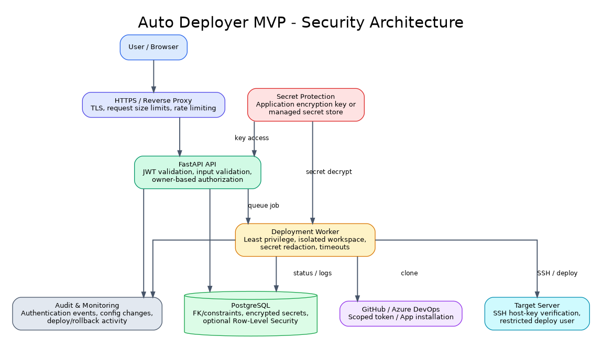
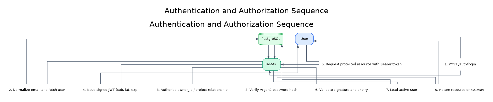
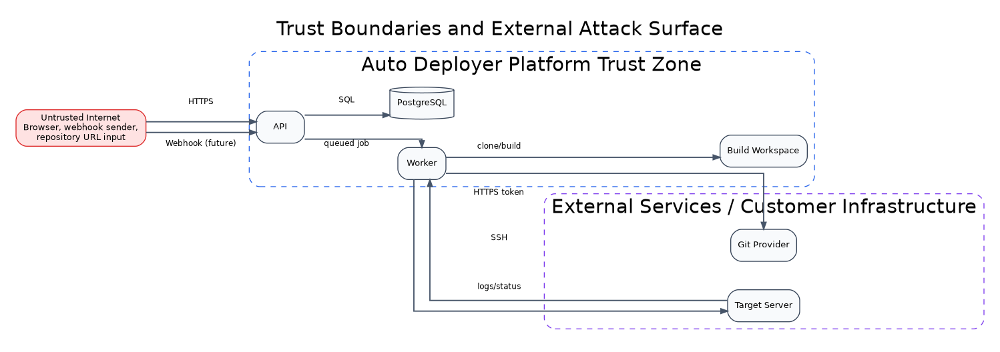
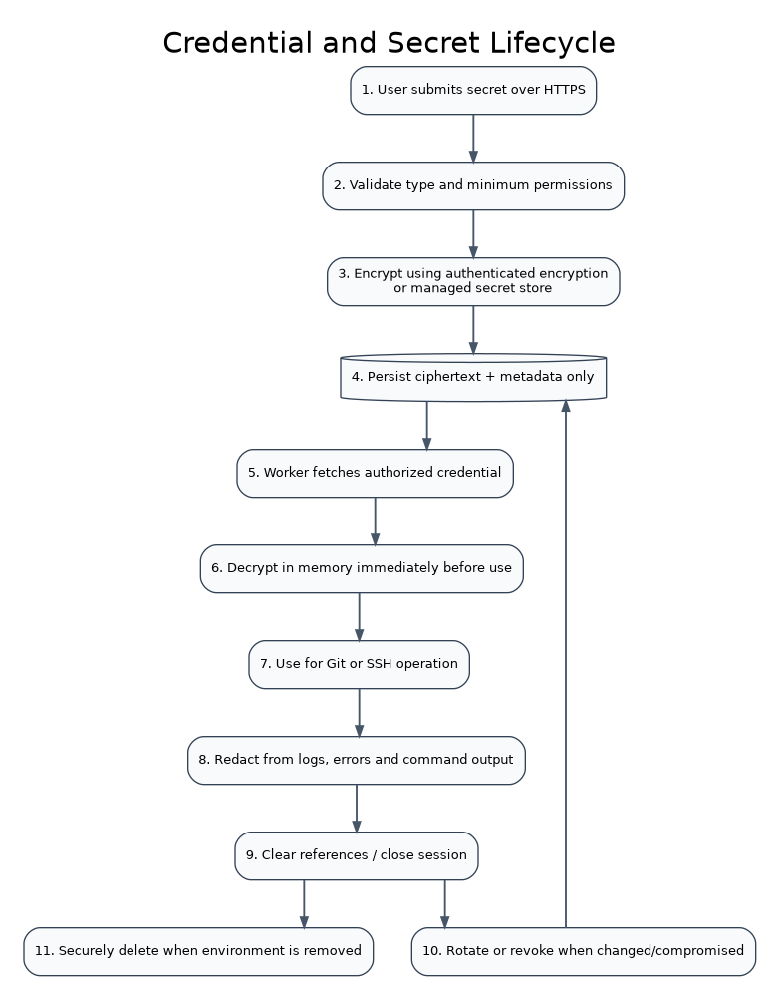

# 07 - Security Architecture

## 7.1 Purpose

This section defines the security model of the Auto Deployer MVP. Security is a core product requirement because the platform handles source-code access, remote-server credentials, deployment execution and multi-user data isolation.

## 7.2 Security Objectives

- Prevent one user from viewing or modifying another user's projects, environments, deployments or credentials.
- Protect passwords, repository tokens, SSH passwords, private keys and cloud credentials.
- Prevent command injection, path traversal, SSRF and unsafe build execution.
- Ensure deployments and rollbacks are attributable and auditable.
- Limit the blast radius of a compromised account, worker or target credential.
- Preserve the currently active application when a candidate deployment fails.

## 7.3 Security Architecture

The platform applies layered controls across the edge, API, database, worker, Git provider and target server. No single control is treated as sufficient on its own.

## 7.4 Authentication and Authorization Sequence

### Authentication

- User passwords are hashed using Argon2.
- Login returns a signed, time-limited JWT access token.
- JWT payload contains a stable user identifier in `sub`, issue time and expiry.
- The server accepts only the configured algorithm and secret/key.
- Inactive or deleted users cannot use previously issued tokens after user lookup.

### Authorization

- Authentication answers "who is the caller?"
- Authorization answers "may this caller access this resource?"
- Project access requires `projects.owner_id == current_user.id`.
- Environment and deployment access is authorized through the owning project.
- Unauthorized ownership access returns `404 Not Found` to avoid disclosing resource existence.
- Platform-administrator capabilities, if introduced, must use explicit roles and separate policies.

## 7.5 Trust Boundaries

Repository content and user-supplied server configuration are untrusted inputs. The deployment worker crosses trust boundaries when it clones code, executes builds and connects to customer infrastructure.

## 7.6 Credential and Secret Lifecycle

### Passwords versus recoverable secrets

- User passwords are one-way hashed.
- SSH passwords, private keys and repository tokens must be recoverable for deployment and therefore require encryption, not hashing.
- Encryption keys must not be stored in the same database row as ciphertext.
- Production should use a managed secret store where available.

## 7.7 Security Requirements

| ID | Control | Priority | Requirement |
|---|---|---|---|
| SEC-001 | Password Storage | Must | Passwords are hashed with Argon2 and never encrypted or logged. |
| SEC-002 | JWT Validation | Must | Every protected endpoint validates signature, algorithm, expiry and active user status. |
| SEC-003 | Owner Isolation | Must | Queries include the authenticated owner or traverse through an owner-controlled project. |
| SEC-004 | Secret Encryption | Must | Repository/server credentials are encrypted with authenticated encryption or held in a managed vault. |
| SEC-005 | SSH Host Verification | Must | The worker verifies known host keys and rejects unexpected key changes. |
| SEC-006 | Least Privilege | Must | Repository tokens, database roles and deploy users receive only required permissions. |
| SEC-007 | Input Validation | Must | URLs, branches, ports, domains, paths and identifiers are validated before use. |
| SEC-008 | Command Safety | Must | No untrusted value is concatenated into shell commands without strict validation/escaping. |
| SEC-009 | Log Redaction | Must | Secrets, tokens, private keys and authorization headers are masked before persistence. |
| SEC-010 | Audit Logging | Should | Security-sensitive actions are append-oriented and attributable to a user. |
| SEC-011 | Rate Limiting | Should | Login and sensitive operations are protected against abuse. |
| SEC-012 | Build Isolation | Must | Untrusted repository code executes in a constrained build environment. |

## 7.8 Tenant and User Isolation

The MVP currently uses direct user ownership rather than full organization tenancy.

Required rules:

1. Every project has a non-null `owner_id`.
2. Every project query filters by both project identifier and current user identifier.
3. Environment ownership is derived through its project.
4. Deployment ownership is derived through project/environment relationships.
5. Credentials are never fetched using only a credential identifier supplied by the client.
6. List endpoints never return global records.
7. Tests must create at least two users and verify cross-user access fails.
8. PostgreSQL Row-Level Security is recommended as defense in depth after application-level rules are stable.

## 7.9 JWT Policy

MVP policy:

- Algorithm: HS256 for development/MVP.
- Access-token lifetime: 60 minutes by default.
- Required claims: `sub`, `iat`, `exp`.
- Tokens are sent only through the `Authorization: Bearer` header.
- Tokens are never written to application logs.
- Secret keys are loaded from environment configuration and excluded from Git.
- Key rotation requires invalidating or phasing out previous signing keys.

Production evolution:

- Prefer asymmetric signing such as RS256/ES256 when multiple services verify tokens.
- Add refresh-token rotation only when a real client requirement exists.
- Add MFA for privileged or production deployment accounts.

## 7.10 Password Policy

- Minimum length: 8 characters for MVP; 12+ recommended for production.
- Maximum length is enforced to prevent resource abuse.
- Passwords are hashed using the library's recommended Argon2 parameters.
- Authentication responses do not reveal whether the email or password was incorrect.
- Login endpoints should be rate-limited and monitored.
- Password reset tokens, when added, must be single-use and time-limited.

## 7.11 SSH Security

- Verify the server host key before authentication.
- Store and display a host-key fingerprint during connection setup.
- Reject host-key changes unless the owner explicitly re-approves them.
- Prefer SSH private keys over passwords.
- Use a dedicated non-root deployment account.
- Grant only the required sudo commands for Docker installation and service control.
- Disable interactive shell assumptions and use bounded command timeouts.
- Never use permissive host-key auto-accept behavior in production.

## 7.12 Repository Security

- Prefer GitHub App installation tokens or narrowly scoped provider tokens.
- Tokens should be read-only unless webhook/configuration operations require more.
- Private repository tokens are decrypted only for the clone operation.
- Clone URLs and branch/ref values are validated.
- Credentials are not embedded permanently in `.git/config`.
- The resolved commit SHA is persisted for auditability.
- Webhook signatures must be validated when automatic deployments are added.

## 7.13 Command Injection and Path Safety

- Use argument arrays instead of shell strings where possible.
- Never pass raw repository names, branches, domain names or container names directly to a shell.
- Generate internal slugs using a strict allow-list.
- Workspace paths are based on server-generated UUIDs.
- Reject path separators, control characters and shell metacharacters from fields that do not require them.
- Use fixed command templates for Docker and system provisioning.
- Validate ports and numeric values before command execution.

## 7.14 Build and Runtime Isolation

Repository code is untrusted.

MVP controls:

- Build in a dedicated workspace.
- Set build time, memory, CPU and disk limits where supported.
- Do not mount sensitive host directories into build containers.
- Do not expose the platform database or environment file to application builds.
- Avoid giving arbitrary repository code unrestricted access to the host Docker socket.
- Clean workspaces after all terminal outcomes.
- Use an isolated worker host for production.

Future controls:

- Ephemeral build runners.
- Rootless BuildKit or dedicated builders.
- Network egress policy.
- Image vulnerability scanning.
- Signed images and provenance attestations.
- Software Bill of Materials generation.

## 7.15 SSRF and Network Controls

The platform may fetch repository URLs and perform health checks, creating SSRF risk.

Controls:

- Allow only supported Git provider domains for provider-managed repositories.
- Resolve hostnames and reject loopback, link-local, metadata-service and prohibited private ranges unless explicitly allowed for customer environments.
- Re-check resolved addresses to reduce DNS rebinding risk.
- Apply outbound network rules to workers.
- Limit health checks to the configured target environment.
- Use short connection and response timeouts.

## 7.16 Database Security

- Use separate database roles for migrations and application runtime.
- Application role receives only required CRUD permissions.
- TLS is required for remote production database connections.
- Database credentials are not committed to Git.
- Foreign keys, unique constraints and check constraints enforce integrity.
- Backups are encrypted and access-controlled.
- Sensitive columns are encrypted at the application layer or stored in a managed vault.
- Audit and deployment-history records use restricted deletion paths.

## 7.17 API and Edge Security

- HTTPS is mandatory outside local development.
- CORS uses an explicit allow-list.
- Request body size limits protect upload/form endpoints.
- Security headers are configured at the reverse proxy.
- Login, connection-test, deployment and rollback endpoints are rate-limited.
- Error responses expose safe messages, not stack traces or secrets.
- API schemas exclude password hashes and encrypted secret values.
- Swagger/OpenAPI exposure can be restricted in production if required.

## 7.18 Logging, Audit and Monitoring

Logs must include enough context for diagnosis without exposing secrets.

Recommended audit events:

- Registration and login outcomes.
- Project/environment creation, update and deletion.
- Credential replacement.
- Deployment start, cancellation and completion.
- Rollback request and result.
- Authorization failures.
- Repeated SSH or repository authentication failures.
- Signing/encryption key rotation.

Audit fields include actor, action, entity type, entity identifier, timestamp, source IP and safe metadata.

## 7.19 STRIDE Threat Model

| Threat category | Example | Primary mitigations |
|---|---|---|
| Spoofing | Stolen token or credential reuse | Short-lived JWTs, password hashing, token validation, optional MFA later |
| Tampering | Modified request, image or deployment state | TLS, signed JWT, immutable commit SHA, database constraints |
| Repudiation | User denies a deploy or rollback | Audit log with actor, time, entity and source IP |
| Information Disclosure | Secrets leak through logs or API responses | Encryption, redaction, response schemas, least privilege |
| Denial of Service | Large builds, repeated login or deployment requests | Rate limits, quotas, timeouts, worker concurrency controls |
| Elevation of Privilege | Cross-user project access or root-level remote abuse | Owner filters, optional RLS, restricted deploy user, sudo allow-list |
| Supply Chain | Malicious repository code or dependency | Build isolation, pinned base images, image scanning in later phase |
| SSRF | Repository/health URLs target internal services | URL allow/deny rules, network egress restrictions, IP range validation |

## 7.20 Incident Response

Minimum MVP procedure:

1. Disable the affected user or credential.
2. Revoke repository and SSH tokens/keys.
3. Preserve audit and deployment logs.
4. Identify impacted projects and environments.
5. Rotate signing and encryption keys if exposure is suspected.
6. Rebuild and redeploy from a trusted commit where required.
7. Document root cause and preventive actions.

## 7.21 Security Testing

Required automated tests:

- Passwords are never stored as plaintext.
- Protected endpoints reject missing, invalid and expired tokens.
- Cross-user project GET/PUT/DELETE requests return 404.
- Cross-user environment/deployment requests fail.
- Secret fields are excluded from response models.
- Log redaction removes known token/password patterns.
- Invalid branches, ports, paths and shell metacharacters are rejected.
- Duplicate concurrent deployment requests do not bypass environment locking.

Recommended later testing:

- Static application security testing.
- Dependency and container-image scanning.
- Dynamic API security testing.
- Secret scanning in Git.
- Infrastructure and SSH configuration review.
- Independent penetration test before production use.

## 7.22 Security Acceptance Criteria

- No plaintext passwords, repository tokens, SSH passwords or private keys are stored.
- A user cannot discover or access another user's resources through identifier manipulation.
- All protected endpoints consistently validate JWTs.
- SSH host identity is verified.
- Deployment commands do not concatenate unvalidated user input.
- Secrets are masked in logs, reports and errors.
- Candidate build/deployment failure does not compromise the active application.
- Security-sensitive activity is auditable.
- The `.env` file and private key material are excluded from Git.
- Production deployment uses HTTPS and least-privilege credentials.

## 7.23 Security Scope After MVP

- Organization membership and role-based access control.
- MFA and enterprise identity providers.
- Managed vault integration.
- Asymmetric JWT signing and key rotation.
- Signed artifacts, SBOM and provenance.
- Kubernetes namespace and workload isolation.
- Policy-as-code and deployment approvals.
- Centralized SIEM integration and anomaly detection.
